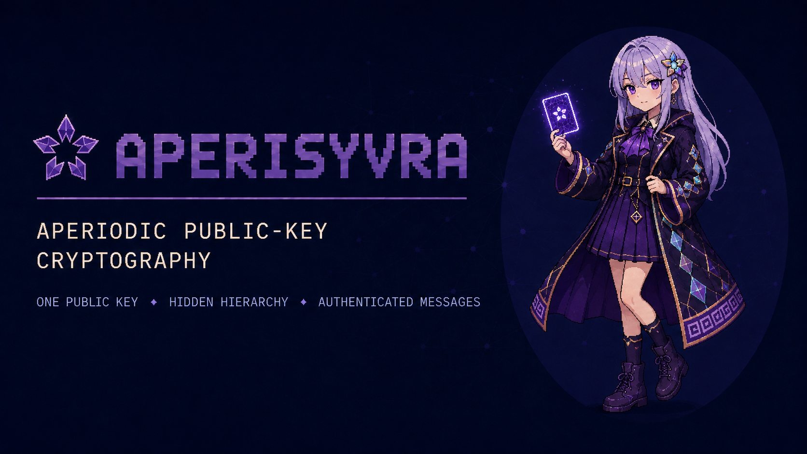
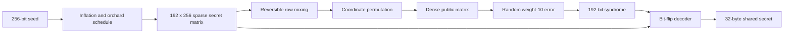

<div align="center">

# AperiSyVra-AHC-N256/R192/W10-P1

### Aperiodic Hidden-Code KEM

**Experimental public-key encryption and key-encapsulation software written in Rust.**



<p>
  
  <a href="https://github.com/urotsuki-san/AperiSyVra/actions/workflows/ci.yml"></a>
  
  <a href="LICENSE"></a>
</p>

**[Quick start](#quick-start)** · **[Design](docs/DESIGN.md)** · **[Formats](docs/FORMAT.md)** · **[Analysis](docs/ANALYSIS.md)** · **[日本語概要](docs/OVERVIEW_JA.md)**

<sub>Short name: <strong>AperiSyVra</strong> · Sister project: <a href="https://github.com/urotsuki-san/OrIsyVra"><strong>OrIsyVra</strong></a> · Version: <strong>0.1.0-alpha.0</strong></sub>

</div>

---

> [!WARNING]
> P1 is a research prototype. It has not received independent cryptanalysis and is not suitable for real keys or confidential data.

## Overview

AperiSyVra studies a code-based public-key construction built from a hidden sparse parity-check matrix. P1 adds a working decoder and an end-to-end message format to the earlier toy profile.

<table>
<tr>
<td width="50%">
<h3>Key encapsulation</h3>
Generate a keypair, encapsulate a 32-byte shared secret with the public key, and recover it with the secret key.
</td>
<td width="50%">
<h3>Message sealing</h3>
The CLI can encrypt and authenticate message files up to 16 MiB with <code>seal</code> and <code>open</code>.
</td>
</tr>
<tr>
<td width="50%">
<h3>Hidden sparse code</h3>
The secret matrix has seven checks per column. Reversible row mixing and a coordinate permutation produce the dense public matrix.
</td>
<td width="50%">
<h3>Built-in measurements</h3>
The analysis tool reports decoder failures, row-degree balance, column overlap, and public matrix density.
</td>
</tr>
</table>

## P1 construction

The secret structure generator combines a Fibonacci inflation word, five orientation classes, primitive directions from Euclid's orchard, and an integer golden recurrence. These descriptors schedule three parity-check bands:

- 96 local rows;
- 64 hierarchy rows;
- 32 orchard rows.

Each of the 256 secret columns touches four local checks, two hierarchy checks, and one orchard check. The generator balances row degrees and avoids repeated row pairs where possible.



Encapsulation selects ten public columns and XORs them into a syndrome. Decapsulation restores the secret syndrome and runs an iterative bit-flip decoder. The recovered positions are verified against the public matrix before the shared secret is returned.

Message sealing derives a SHAKE256 stream and a 256-bit authentication tag from the encapsulated secret. The message layer is part of the P1 experiment and shares its security status.

## Quick start

### Build and test

```bash
git clone https://github.com/urotsuki-san/AperiSyVra.git
cd AperiSyVra
cargo test --locked --workspace --all-features
```

### Generate a keypair

```bash
cargo run --locked --release -p aperisyvra -- keygen \
  --public alice.avpk \
  --secret alice.avsk
```

### Seal and open a message

```bash
cargo run --locked --release -p aperisyvra -- seal \
  --public alice.avpk \
  --input message.txt \
  --output message.avm

cargo run --locked --release -p aperisyvra -- open \
  --secret alice.avsk \
  --input message.avm \
  --output opened.txt
```

### Use the KEM directly

```bash
cargo run --locked --release -p aperisyvra -- encapsulate \
  --public alice.avpk \
  --ciphertext session.avct \
  --shared sender.shared

cargo run --locked --release -p aperisyvra -- decapsulate \
  --secret alice.avsk \
  --ciphertext session.avct \
  --shared receiver.shared
```

## Parameters

| Parameter | P1 value |
|---|---:|
| Code coordinates | **256** |
| Syndrome width | **192 bits** |
| Error weight | **10** |
| Secret column weight | **7** |
| Decoder rounds | **32 maximum** |
| Public key | **6,176 bytes** |
| Secret key | **44 bytes** |
| KEM ciphertext | **52 bytes** |
| Shared secret | **32 bytes** |
| Sealed-message overhead | **116 bytes** |
| Message limit | **16 MiB** |

The profile name records construction parameters, not a security level.

## Analysis

Run a deterministic decoder scan:

```bash
cargo run --locked --release -p aperisyvra-analysis -- decoder-scan \
  --trials 10000 \
  --seed 7
```

Inspect a generated matrix:

```bash
cargo run --locked --release -p aperisyvra-analysis -- matrix-report \
  --secret alice.avsk

cargo run --locked --release -p aperisyvra-analysis -- public-report \
  --public alice.avpk
```

P1 still needs structural cryptanalysis, larger failure-rate studies, side-channel work, and independent review. The current analysis commands provide reproducible starting points for that work.

## SyVra family

| Project | Area | Core design |
|---|---|---|
| **[OrIsyVra](https://github.com/urotsuki-san/OrIsyVra)** | Symmetric file and volume encryption | Collision-Wave permutation and record construction |
| **AperiSyVra** | Public-key encryption and KEM research | Hidden aperiodic parity-check code |

## Documentation

| Document | Contents |
|---|---|
| [`docs/DESIGN.md`](docs/DESIGN.md) | Matrix generation, hiding transform, decoder, KEM, and message layer |
| [`docs/FORMAT.md`](docs/FORMAT.md) | Public key, secret key, ciphertext, and sealed-message formats |
| [`docs/ANALYSIS.md`](docs/ANALYSIS.md) | Measurements and current attack surface |
| [`docs/ROADMAP.md`](docs/ROADMAP.md) | Planned research and engineering work |
| [`docs/RESEARCH.md`](docs/RESEARCH.md) | Reference material |
| [`docs/OVERVIEW_JA.md`](docs/OVERVIEW_JA.md) | Japanese overview |
| [`SECURITY.md`](SECURITY.md) | Security reporting |

## Status

**0.1.0-alpha.0 · P1 research prototype**

P1 provides working key generation, KEM operations, authenticated message sealing, binary formats, tests, and cross-platform CI. Its security level is undetermined.

## License

[MIT](LICENSE)
